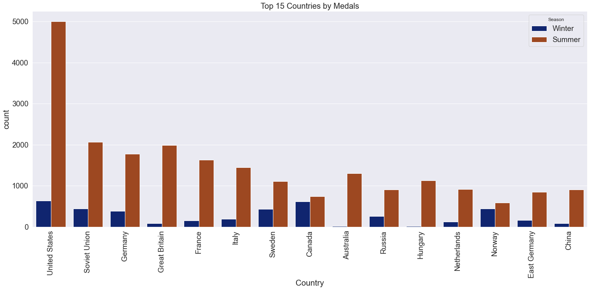
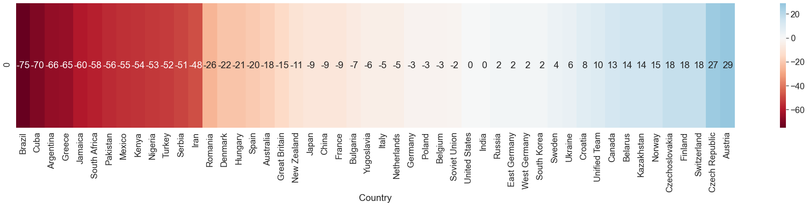
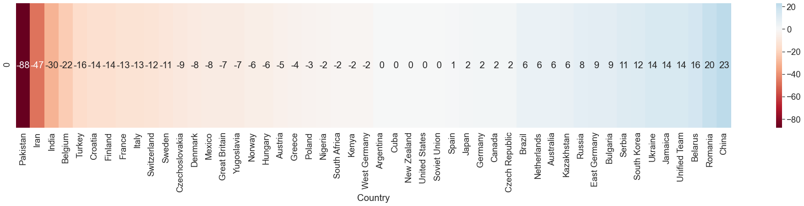
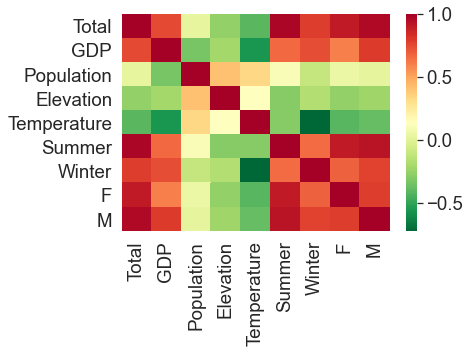
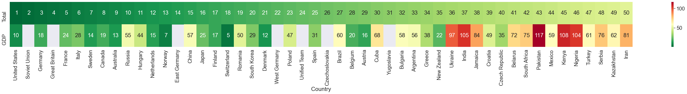
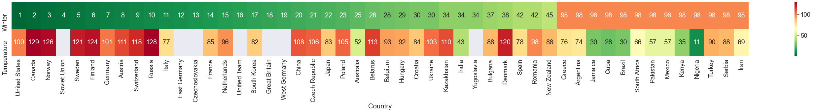

# olympic_history
120 years of Olympic history: athletes and results basic bio data on athletes and medal results from Athens 1896 to Rio 2016.
An analysis of the most succesful countries with explanations to their success or failure.

The analysis helps to find answers on questions such as, how do genders' success differ, what could be causing a success for a country and how does financial situation affect a nation. 

The data has been acquired from [Kaggle](https://www.kaggle.com/heesoo37/120-years-of-olympic-history-athletes-and-results). The dataset includes the contestants' name, sex, age, height, weight, country, medals won and sport category, while including the on the venue, such as year, season, city.

After filtering the dataset new attributes were added. Each cuontry's GDP, average elevation and temperature were attached.

### The most successful countries
The 15 most outstanding nations in the history of olympics, chosen by the total amount of medals won.

### Differences in genders and editions
The number on the charts show the differences in the ranks between season and genders. For example United States has a value of 0 on this chart, meaning that they are ranked at the same position in the displayed categories. However Brazil is a lot stronger in summer games compared to winter games.

Some countries are more successfull in winter, some are in summer editions. The higher the numer is, the more successful the country is in winter games.

The difference in some cultures can be displayed by the contrast of medals won by males and females. The higher number is, the more successfull women are compared to men.

### Relations

To help finding more relations and connections a heatmap has been made using the aggregated values. It displays each country's total medals won, GDP, Population, Elevation, Temperature, Summer medals, Winter medals, Female and Male medals.

**Observations from the heatmap:**
- Positive correlation between : Total medals and GDP
- Negative correlation between : Winter medals and Averagre Temperature

The top 50 countries are ranked in these factors to create the following heatmap. The United States dominates accross almost all categories.

### The 2 observations made above are represented in a similar fashion.
#### The higher the GDP, the more medals the country has.

#### The lower the temperature, the more winter medals the country has.

